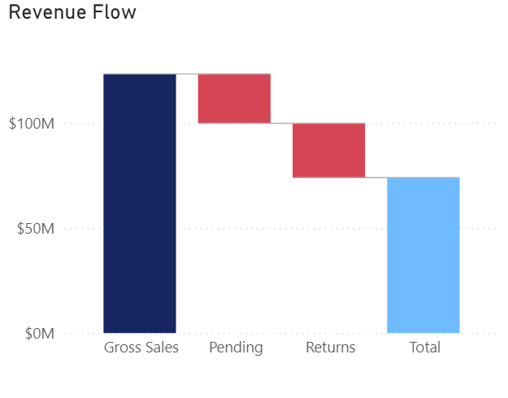
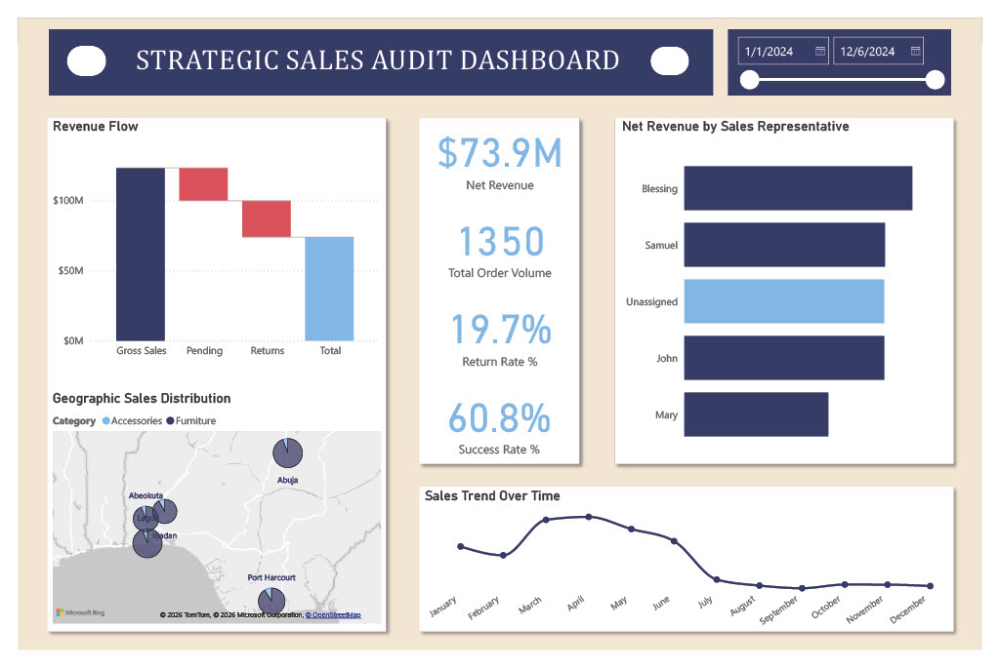

# Strategic-Sales-Audit
## *Uncovering Revenue Leakage and Optimizing Fulfillment through Data Integrity*
## Project Overview & Objective
In the modern retail environment, *"Gross Sales"* is often a vanity metric. This project was born out of a need to look past the surface-level numbers of a fragmented 1,350-row sales dataset. The objective was clear: transform a "noisy" and "messy" database into a high-integrity analytical tool that identifies exactly where money is being made, where it is being lost, and why 40% of the sales pipeline never reaches the bank.
## The Data Cleaning Story
The raw data arrived in a state of "digital disarray." My primary challenge was that the data was mathematically "silent" in certain places and contradictory in others.
### *The Challenges*
  1. **Split Timelines:** Order dates were fragmented across columns, making trend analysis impossible.
  2. **Financial Gaps:** Many records were missing total revenue, despite having unit prices.
  3. **ID Conflicts:** 59 specific Order IDs were recycled across different regions and customers, leading to a total of 61 redundant rows, threatening to double-count or delete valid transactions.
### *The Power Query Actions*
  1. **Date Normalization:** I merged and standardized the date components to create a continuous timeline for trend tracking.
  2. **Revenue Reconciliation:** I wrote custom logic to recalculate Revenue ($Unit Price \times Quantity$) to fill the financial gaps without deleting valuable customer records.
  3. **The Composite Key Solution:** To handle duplicate Order IDs, I generated a "Unique Transaction ID" with Index 1 to 1350. This preserved the 61 "conflicting" orders as unique sales events.
  4. **Categorical Alignment:** I performed a "fuzzy" cleanup to fix spelling errors in product categories and tagged missing Sales Reps as "Unassigned" to maintain a complete audit trail.
## The Business Goals
We didn't just want a "pretty chart." We aimed to:
  1. **Stop the Leakage:** Understand the gap between an order being placed and cash being realized.
  2. **Evaluate Rep Performance:** Determine who is driving value and where the "Unassigned" revenue gap is occurring.
  3. **Regional Optimization:** Identify if certain regions are underperforming due to logistics (Returns) or demand.
## Core Business Questions
To guide the design, I focused on five "high-stakes" questions:
  1. How much of our Gross Sales is actually "Net Revenue" after returns and pending delays?
  2. Which regions are the true powerhouses of the business?
  3. What is the "Success Rate" of a transaction from start to finish?
  4. Are our returns tied to specific products or specific regions?
  5. Why has sales volume trended downward over the measured period?
## The Revenue Bridge
The centerpiece of this analysis is the *Revenue Bridge*. It tells the story of our money flow. We start with a **Gross Sales potential of $123.26M**. However, as we move through the *"Lifecycle"*, we lose *$25.84M to Returns and have $23.5M stuck in Pending*. This leaves us with a **Net Revenue of $73.92M**. This bridge visualizes the *"leakage"* that would otherwise be hidden in a standard profit-and-loss statement.

## Key Insights
  1. **The 20% Return Wall:** I discovered that both Furniture and Accessories have a near-identical 20% return rate. This suggests the issue isn't the product type, but perhaps a shipping or "expectation" gap common to the entire business.
  2. **The "Invisible" Giant:** *"Unassigned"* sales represent $15.2M. If this were a person, they would be our 3rd best Sales Rep. This is a massive data-governance failure.
  3. **The 60% Success Ceiling:** Our success rate is only 60.8%. This means for every 10 orders our team works hard to get, nearly 4 fall through the cracks.
## Data Quality Note
Data isn't always perfect, and transparency is key.
  1. **Missing Values:** I intentionally kept rows with missing Revenue values to ensure that my volume analysis (Success/Return Rates) and Sales Rep Activity metrics remained accurate but excluded them from financial totals (AOV/Net Revenue) to avoid dragging down averages.
  2. **Duplicate IDs:** During the audit, I identified that the system's 'Order_ID' is not a reliable primary key. While there are 1,350 total transactions, there are only 1,289 unique Order IDs. Specifically, 59 unique ID numbers were recycled, leading to 61 redundant ID entries. To solve this without losing the $15.7M in revenue associated with these duplicates, which would have significantly undervalued the Lagos and Abuja markets, I implemented a Composite Key strategy as mentioned in the data cleaning story.
## The Way Forward
The most concerning trend identified is the steady decline in sales over the months. The trend lines show a month-over-month drop in completed orders. This could be caused by "Return Fatigue", such that high return rates in early months have damaged customer trust, or a "Fulfillment Bottleneck" shown by the high volume of Pending orders.

**I therefore recommend that the company should:**
  1. Work on the order fulfillment. More focus should be on clearing the $23.5M in "Pending" orders. Converting just half of these would increase Net Revenue by over 15%.
  2. Investigate why 1 in 5 items is returned. A "Customer Feedback Loop" should be implemented to identify if shipping damage is the culprit.
  3. Enhance process optimization by ensuring that the "Sales Rep" field in the order entry system becomes mandatory because we cannot reward a team if $15M of their work is "Unassigned.
  4. Implement a "Re-engagement Campaign" for customers who haven't returned items, while offering "Incentivized Shipping" to reduce the friction that leads to Pending status in order to fix the downward sales trend.
## Dashboard Preview

## Technical Appendix
In order to provide a true picture of the business, a measures table containing a total of 11 measures was developed.

[Download the Power BI file](https://github.com/Kaynan-create/Strategic-Sales-Audit-Analysis/raw/main/Strategic_Sales_Audit.pbix?raw=true)

*Authored By:* **Canaan olanipekun**

*Date:* **February 2026**
